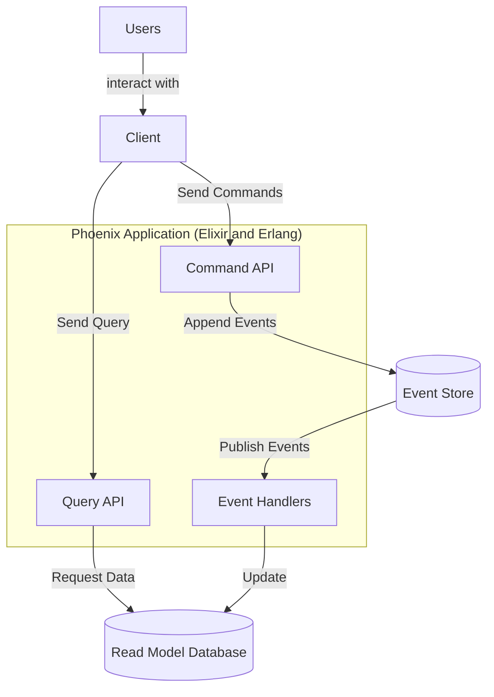

```mermaid
flowchart TD
    subgraph subGraph0["Phoenix Application (Elixir and Erlang)"]
        CommandAPI["Command API"]
        QueryAPI["Query API"]
        EventHandlers["Event Handlers"]
    end
    Users["Users"] -- interact with --> Clients["Client"]
    Clients -- Send Commands --> CommandAPI
    Clients -- Send Query --> QueryAPI
    CommandAPI -- Append Events --> EventStore[("Event Store")]
    QueryAPI -- Request Data --> ReadModelDB
    EventStore -- Publish Events --> EventHandlers
    EventHandlers -- Update --> ReadModelDB[("Read Model Database")]
```